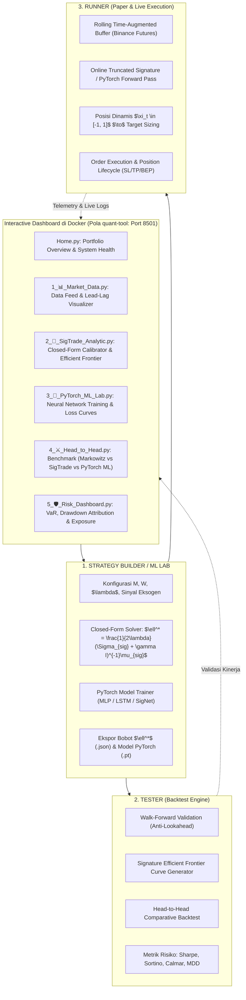
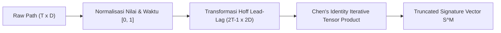
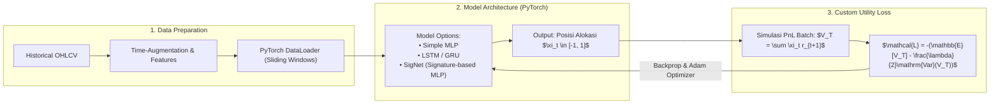
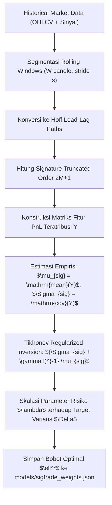
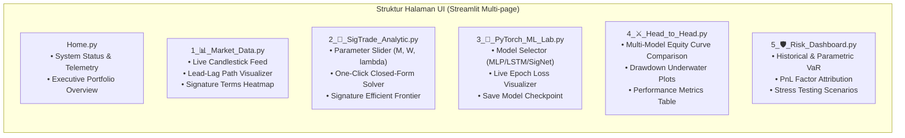
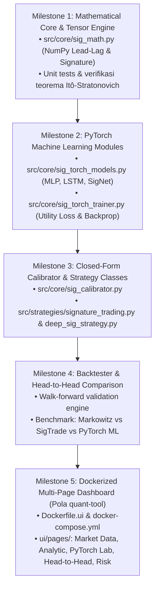

[]()# Blueprint Rencana Implementasi: Signature Trading (Sig-Trading)
### *A Path-Dependent Extension of the Mean-Variance Framework with Exogenous Signals & PyTorch Machine Learning Lab*
**Target Project:** `TradeProject` (Builder, Tester, Runner, UI Dashboard)  
**Dokumen Referensi:** `SigTrade/sigtrade_cleaned.md` (Owen Futter, Blanka Horvath, Magnus Wiese - arXiv:2308.15135)  
**Referensi Dashboard & Docker:** `/home/tabassam/Documents/github_collection/quant-tool/`

---

## 1. Eksekutif Ringkasan & Konsep Utama

### 1.1 Paradigma: Dari *Predict-then-Optimise* Menuju *End-to-End Signature Optimization*
Pendekatan kuantitatif konvensional (seperti model faktor Fama-French atau regresi linier drift) memisahkan proses trading menjadi dua tahap:
1. **Prediksi Return:** $\mu_{t+1} = \mathbb{E}[r_{t+1} \mid \mathcal{F}_t] = B f_t + \varepsilon_{t+1}$
2. **Optimasi Portofolio:** $\xi_t^* = \frac{1}{\lambda} \Sigma_t^{-1} \mu_t$

Kelemahan fatal pendekatan konvensional pada data finansial kripto adalah **akumulasi residual asimetris dan heteroskedastisitas**: sinyal memiliki *signal-to-noise ratio* (SNR) rendah, autokorelasi meluruh lambat, serta volatilitas path-dependent. Kesalahan estimasi regresi pada tahap (1) akan diperbesar secara kuadratik saat dibalik melalui matriks kovarians pada tahap (2).

**Solusi Sig-Trading (Futter et al., 2023) & Ekstensi PyTorch ML:**
Mengintegrasikan teori lintasan kasar (*Rough Path Theory*) dan transformasi *Signature* untuk memetakan dinamika gabungan harga aset ($X_t$) dan sinyal eksogen ($f_t$) secara langsung ke posisi optimal $\xi_t$:
$$\xi_t^m = \langle \ell^m, \mathbb{S}^{\le M}(\hat{Z}_{0,t}) \rangle$$
Di mana $\ell^m$ adalah fungsional linier (vektor bobot) yang dioptimalkan secara analitik dalam bentuk **closed-form** (solusi eksak), tanpa memerlukan regresi return perantara, tanpa backpropagation neural network yang berat, dan secara intrinsik menyertakan kontrol *drawdown* temporal.

Selain pendekatan closed-form analitik, proyek ini juga menyediakan **PyTorch Machine Learning Lab** untuk melatih model Deep Learning (LSTM, GRU, MLP, dan Deep SigNet) yang mengoptimalkan fungsi utilitas/Sharpe Ratio secara end-to-end melalui *gradient descent*.

```mermaid
flowchart TB
    subgraph S1["1. Pendekatan Klasik (Predict-then-Optimise)"]
        direction LR
        A["Harga & Sinyal<br/>$f_t, X_t$"] -->|"Regresi Least-Squares"| B["Return Prediksi<br/>$\mu_{t+1}$"]
        B -->|"Inversi Kovarians"| C["Posisi Trading<br/>$\xi_t^*$"]
        B -.->|"⚠️ Akumulasi Error"| B
        C -.->|"⚠️ Error Magnification"| C
    end

    subgraph S2["2. Pendekatan Sig-Trading (End-to-End Closed-Form)"]
        direction LR
        D["Lintasan Teraugmentasi<br/>$\hat{Z}_t = (t, X_t, f_t)$"] -->|"Hoff Lead-Lag"| E["Lead-Lag Path<br/>$\hat{Z}^{LL}$"]
        E -->|"Tensor Signature"| F["Signature Space<br/>$\mathbb{S}^{\le M}$"]
        F -->|"Solusi Analitik $\ell^*$"| G["Posisi Optimal<br/>$\xi_t = \langle \ell^*, \mathbb{S} \rangle$"]
    end

    subgraph S3["3. Pendekatan Deep Sig-Trading (PyTorch ML Lab)"]
        direction LR
        H["Signature / Raw Path"] -->|"Neural Net (MLP/LSTM)"| I["Hidden Latent Features"]
        I -->|"Custom Loss: -Sharpe / -Utility"| J["Posisi Dinamis $\xi_t^{ML}$"]
        J -.->|"Backpropagation & Adam"| I
    end
```



---

## 2. Pemetaan Komponen ke Ekosistem `TradeProject`

Proyek ini mengadopsi arsitektur tiga serangkai (**Builder**, **Tester**, dan **Runner**) yang terintegrasi penuh dengan **Interactive Docker Dashboard** (mengadopsi pola modular dari repositori referensi `quant-tool`):



---

## 3. Formulasi Matematis Eksak

### 3.1 Proses Gabungan Teraugmentasi Waktu (Time-Augmented Market Factor Process)
Misalkan terdapat $d$ aset tradable $X_t = (X_t^1, \dots, X_t^d)$ dan $N$ sinyal eksogen non-tradable $f_t = (f_t^1, \dots, f_t^N)$.  
Definisikan proses gabungan berdimensi $D = 1 + d + N$:
$$\hat{Z}_t := \left( \frac{t - t_0}{T - t_0}, \frac{X_t^1}{X_0^1}, \dots, \frac{X_t^d}{X_0^d}, f_t^1, \dots, f_t^N \right) \in \mathbb{R}^{1+d+N}$$
*Catatan Penting:* Komponen waktu $t$ dinormalisasi ke interval $[0, 1]$ dan harga aset diskalakan terhadap harga awal untuk memastikan invarian terhadap skala dan menjaga kestabilan numerik aljabar tensor.

### 3.2 Transformasi Hoff Lead-Lag (Itô Correction via Stratonovich)
PnL strategi trading riil adalah integral stokastik Itô:
$$V_T = \sum_{m=1}^d \int_0^T \xi_t^m \, dX_t^m$$
Karena signature secara alami beroperasi pada kalkulus Stratonovich, maka untuk merekonstruksi integral Itô tanpa aproksimasi bias, kita menerapkan **Transformasi Hoff Lead-Lag** (Definition 2.3 & Theorem 2.10 paper):
Untuk lintasan diskret $\hat{Z}_{t_0}, \dots, \hat{Z}_{t_K}$, dibentuk lintasan baru $\hat{Z}^{LL} \in \mathbb{R}^{2D}$ berukuran $2(1+d+N)$:
$$\hat{Z}^{LL}_{2k} = (\hat{Z}_{t_k}, \hat{Z}_{t_k}), \quad \hat{Z}^{LL}_{2k+1} = (\hat{Z}_{t_{k+1}}, \hat{Z}_{t_k})$$
- Komponen **Lead**: bergerak mendahului ($\hat{Z}^{lead}$).
- Komponen **Lag**: menahan nilai sebelumnya ($\hat{Z}^{lag}$).
Dengan transformasi ini, luas area antara lead dan lag mengompensasi kovariasi kuadratik $[X, \xi]_t$, sehingga integral Stratonovich pada lintasan Hoff setara eksak dengan integral Itô!

### 3.3 Representasi PnL Melalui Operator Pergeseran (Shift Operator $f(m)$)
Berdasarkan Theorem 2.11 paper, PnL terminal dapat dinyatakan sebagai evaluasi fungsional linier terhadap signature proses lead-lag:
$$V_T = \sum_{m=1}^d \langle \ell^m \mathbf{f}(m), \mathbb{S}(\hat{Z}^{LL}_{0,T}) \rangle$$
Di mana $\mathbf{f}(m)$ adalah operator pergeseran alfabet (*word shift operator*) yang memetakan indeks aset ke komponen lead diferensial $dX^{m, lead}$ pada koordinat tensor lead-lag.

### 3.4 Ekspektasi PnL & Kovarians Signature Empiris
Untuk himpunan sampel lintasan historis $\{ \hat{Z}^{(i)} \}_{i=1}^K$, hitung signature lead-lag terpotong order $\le 2M+1$ untuk setiap sampel $i$.  
Definisikan vektor fitur PnL teratribusi untuk kata $w$ dan aset $m$:
$$y^{(i)}_{w, m} = \langle w \mathbf{f}(m), \mathbb{S}(\hat{Z}^{LL, (i)}_{0,T}) \rangle$$

Maka:
1. **Signature PnL Attribution Vector ($\mu_{sig}$):**
   $$\mu_{sig}[w, m] = \frac{1}{K} \sum_{i=1}^K y^{(i)}_{w, m}$$
2. **Signature PnL Covariance Matrix ($\Sigma_{sig}$):**
   $$\Sigma_{sig} = \frac{1}{K} \sum_{i=1}^K \left( y^{(i)} - \mu_{sig} \right) \left( y^{(i)} - \mu_{sig} \right)^\top$$

### 3.5 Solusi Tertutup Optimal (Closed-Form Analytical Solution)
Fungsi Lagrange Mean-Variance:
$$\max_{\ell} \; \ell^\top \mu_{sig} - \lambda \, \ell^\top \Sigma_{sig} \ell$$
Dengan regularisasi Tikhonov (Ridge) $\gamma > 0$ untuk menjamin *positive-definiteness* numerik saat dimensi tensor besar:
$$\ell^* = \frac{1}{2\lambda} \left( \Sigma_{sig} + \gamma I \right)^{-1} \mu_{sig}$$
Parameter skalar $\lambda$ dikalibrasi terhadap target batas varians PnL $\Delta$:
$$\lambda = \frac{1}{2\sqrt{\Delta}} \sqrt{\mu_{sig}^\top (\Sigma_{sig} + \gamma I)^{-1} \mu_{sig}}$$

### 3.6 Formulasi Deep Learning (PyTorch End-to-End Objective)
Untuk pendekatan Machine Learning berbasis neural network, model parametrik $f_\theta$ (misal LSTM atau MLP) memetakan fitur lintasan langsung ke posisi trading $\xi_t = \tanh(f_\theta(Z_{0,t})) \in [-1, 1]$.
Fungsi rugi (*Custom Loss Function*) didefinisikan secara langsung dari fungsi objektif mean-variance:
$$\mathcal{L}(\theta) = - \left( \hat{\mathbb{E}}[V_T(\theta)] - \frac{\lambda}{2} \widehat{\text{Var}}[V_T(\theta)] \right)$$
atau memaksimalkan Sharpe Ratio diferensiabel secara langsung:
$$\mathcal{L}_{\text{Sharpe}}(\theta) = - \frac{\hat{\mathbb{E}}[R_t(\theta)]}{\hat{\sigma}(R_t(\theta)) + \epsilon}$$

---

## 4. Desain Struktur File & Arsitektur Sistem

Berikut adalah arsitektur direktori yang mengintegrasikan engine Signature, PyTorch ML Lab, dan Docker Dashboard berbasis `quant-tool`:

```
TradeProject/
├── Dockerfile.ui                     # Multi-stage build Docker untuk Streamlit + PyTorch CPU
├── docker-compose.yml                # Orkestrasi container UI (port 8501) & background worker
├── requirements.txt                  # Dependensi inti: streamlit, plotly, torch, pandas, ccxt
├── src/
│   ├── core/
│   │   ├── sig_math.py              # [BARU] Engine NumPy murni untuk Lead-Lag, Signature & Tensor
│   │   ├── sig_calibrator.py        # [BARU] Estimator mu_sig, Sigma_sig, solver l*, & persistence
│   │   ├── sig_torch_models.py      # [BARU] PyTorch Models (LSTM, MLP, SigNet) & Custom Loss
│   │   ├── sig_torch_trainer.py     # [BARU] Training pipeline PyTorch dengan progress callback
│   │   └── math_engine.py           # [EKSISTING] Sumber volatilitas & filter regime
│   ├── strategies/
│   │   ├── base_strategy.py         # [EKSISTING] Base class strategi
│   │   ├── signature_trading.py     # [BARU] Closed-Form SigTrade Strategy
│   │   └── deep_sig_strategy.py     # [BARU] PyTorch Deep Learning Strategy
│   ├── backtester.py                # [UPDATE] Integrasi SigTrade walk-forward & benchmark ML
│   ├── paper_trader.py               # [UPDATE] Integrasi online evaluation
│   └── live_trader.py                # [UPDATE] Integrasi eksekusi live
├── models/
│   ├── sigtrade_weights.json        # [BARU] Bobot fungsional analitik l*
│   └── torch_checkpoints/           # [BARU] Bobot model neural network PyTorch (.pt)
├── strategy_config.json             # [UPDATE] Konfigurasi parameter strategi
├── ui/                              # [UPDATE] Dashboard multi-page ala quant-tool
│   ├── Home.py                      # Landing page, status sistem, ringkasan metrik
│   └── pages/
│       ├── 1_📊_Market_Data.py      # Live data feed, visualisasi Lead-Lag & Signature terms
│       ├── 2_📐_SigTrade_Analytic.py# Kalibrasi analitik closed-form & Signature Efficient Frontier
│       ├── 3_🧠_PyTorch_ML_Lab.py   # Training lab PyTorch (loss curves, architecture selector)
│       ├── 4_⚔️_Head_to_Head.py     # Perbandingan: Markowitz vs Closed-Form vs PyTorch ML
│       └── 5_🛡️_Risk_Dashboard.py   # Metrik risiko ala quant-tool (Drawdown, VaR, PnL Attribution)
└── sigtrade_imp.md                  # Dokumen blueprint spesifikasi ini
```

---

## 5. Rencana Detail Implementasi Komponen (Step-by-Step)

### FASE 1: Core Mathematical Engine (`src/core/sig_math.py`)
Membangun modul matematika signature berbasis NumPy murni agar **ringan, cepat, dan mandiri** (tidak wajib bergantung pada library C++ eksternal seperti `iisignature`, tetapi menyediakan kompatibilitas tensor penuh).



#### Fitur Utama `sig_math.py`:
1. **`hoff_lead_lag(path: np.ndarray) -> np.ndarray`**:
   Membangun lintasan berdimensi $(2T-1, 2D)$ sesuai rumus interpolasi Hoff.
2. **`compute_signature(path: np.ndarray, order: int = 2) -> np.ndarray`**:
   Menghitung tensor signature terpotong dari level 0 ($\emptyset$), level 1 ($\int dX$), level 2 ($\iint dX \otimes dX$) via identitas Chen.
3. **`get_word_indices(dim: int, order: int) -> List[Tuple]`**:
   Menyediakan katalog multi-indeks kata (words) untuk identifikasi fungsional dan operator shift $\mathbf{f}(m)$.
4. **`apply_shift_operator(word: Tuple, asset_idx: int, dim: int) -> Tuple`**:
   Menggabungkan kata basis dengan kanal lead diferensial aset yang bersangkutan.

---

### FASE 2: PyTorch Machine Learning Engine (`src/core/sig_torch_models.py` & `sig_torch_trainer.py`)
Menyediakan modul pembelajaran Machine Learning yang mengeksploitasi arsitektur neural network di PyTorch untuk mengoptimalkan utilitas portofolio secara langsung.



#### Komponen Utama PyTorch:
1. **Model Architectures (`sig_torch_models.py`):**
   - **`SigNetMLP`:** Mengambil input berupa signature $\mathbb{S}^{\le M}(\hat{Z})$, melewati layer linear `Linear(d_sig, hidden) -> ReLU -> Dropout -> Linear(hidden, 1) -> Tanh()`.
   - **`TimeSeriesLSTM`:** Mengambil deret waktu sekuensial mentah `(batch, seq_len, features)` dengan layer LSTM untuk membandingkan performa model deep learning sekuensial murni.
2. **Custom Loss Functions:**
   - **`MeanVarianceUtilityLoss`:** Menghitung negatif dari utilitas mean-variance dari return portofolio batch.
   - **`DirectSharpeLoss`:** Menghitung negatif Sharpe Ratio batch: $-\frac{\text{Mean}(R)}{\text{Std}(R) + \epsilon}$.
3. **Trainer Pipeline (`sig_torch_trainer.py`):**
   - Mendukung early stopping, learning rate scheduler, dan callback untuk visualisasi progress bar dan kurva loss di Streamlit secara real-time.

---

### FASE 3: Modul Strategi Berbasis Lintasan (`src/strategies/signature_trading.py` & `deep_sig_strategy.py`)
Mewarisi `BaseStrategy` agar sepenuhnya kompatibel dengan pipeline eksekusi `TradeProject`.

#### Logika Operasi:
1. **Closed-Form Strategy (`signature_trading.py`):**
   - Menghitung $\mathbb{S}^{\le M}(\hat{Z})$ dari window berjalan $W$ candle terakhir.
   - Evaluasi $\text{raw\_score} = \langle \ell^*, \mathbb{S}^{\le M}(\hat{Z}) \rangle$.
   - Normalisasi ke rentang sinyal diskret $[-4.0, +4.0]$ via $4.0 \times \tanh(\text{raw\_score} / \sigma_{\text{calib}})$.
2. **PyTorch Deep Strategy (`deep_sig_strategy.py`):**
   - Memuat model PyTorch `.pt` yang telah dilatih dari `models/torch_checkpoints/`.
   - Menjalankan forward inference (eval mode, `torch.no_grad()`).
   - Mengalokasikan bobot portofolio proporsional dengan output posisi neural network.

---

### FASE 4: Engine Kalibrator Offline & Rolling (`src/core/sig_calibrator.py`)
Modul analitik yang mengestimasi bobot fungsional $\ell^*$ dari data masa lalu tanpa training/backpropagation (solusi eksak satu langkah).



---

### FASE 5: Integrasi Tester & Validasi Anti-Overfitting (`src/backtester.py`)

#### Metodologi Pengujian:
1. **Walk-Forward Validation (Rolling Re-calibration):**
   - Membagi data historis menjadi jendela rolling Train/Test (misal 30 hari train, 15 hari test out-of-sample).
   - Menghilangkan sepenuhnya *lookahead bias*.
2. **Head-to-Head Benchmark Suite:**
   - Membandingkan performa 4 model sekaligus pada periode data yang sama:
     - **Model 0:** Buy and Hold (Benchmark pasar).
     - **Model 1:** Klasik Markowitz (Order $M=0$).
     - **Model 2:** Closed-Form SigTrade (Order $M=1$ dan $M=2$).
     - **Model 3:** PyTorch Deep SigNet / LSTM.
3. **Metrik Evaluasi:**
   - Total Return (%), CAGR, Annualized Sharpe Ratio, Sortino Ratio, Calmar Ratio, Maximum Drawdown (MDD), dan Win Rate.

---

### FASE 6: Dockerized Multi-Page Dashboard (Mengadopsi Pola `quant-tool`)

Berdasarkan referensi dashboard pada `/home/tabassam/Documents/github_collection/quant-tool/`, antarmuka pengguna `TradeProject` ditata menjadi multi-page application yang responsif, modular, dan dijalankan melalui Docker Compose:



#### Konfigurasi Docker:
- **`Dockerfile.ui`:** Menggunakan base image `python:3.11-slim`, menginstall dependensi build yang diperlukan, dan menginstall PyTorch CPU (`--extra-index-url https://download.pytorch.org/whl/cpu`) agar ukuran container tetap ringkas (< 500MB).
- **`docker-compose.yml`:**
  - Port mapping: `8501:8501`.
  - Volume mounting: `.:/app` untuk live code reloading (`STREAMLIT_SERVER_RUN_ON_SAVE=true`).
  - Healthcheck HTTP: `curl --fail http://localhost:8501/_stcore/health`.

---

## 6. Penanganan Kendala Numerik & Mitigasi Risiko

| Potensi Kendala | Penjelasan Matematis | Solusi & Strategi Mitigasi |
| :--- | :--- | :--- |
| **Curse of Dimensionality** | Jumlah suku signature bertambah secara eksponensial terhadap dimensi $D$ dan order $M$: $\sum_{k=0}^M D^k$. | Batasi order $M \le 2$ untuk data trading live. Gunakan fitur seleksi sinyal eksogen relevan ($N \le 3$) agar dimensi tensor tetap terkontrol (< 300 suku). |
| **Ill-Conditioned Covariance Matrix** | Beberapa suku signature memiliki korelasi tinggi, menyebabkan matriks $\Sigma_{sig}$ mendekati singular. | Terapkan Tikhonov Regularization $\Sigma_{sig} + \gamma I$ dengan $\gamma \in [10^{-5}, 10^{-3}]$ atau Moore-Penrose Pseudo-Inverse (`np.linalg.pinv`). |
| **Exploding Tensor Values** | Nilai iterated integral $\int \dots \int dX$ dapat meledak jika deret harga tidak dinormalisasi. | Normalisasi wajib: skala harga $P_t / P_0 - 1.0$ dan waktu $t / T \in [0, 1]$ pada setiap sliding window. |
| **Overfitting di Neural Network** | Model PyTorch LSTM/MLP menghafal derau acak data finansial historis. | Gunakan Dropout (0.2), L2 Weight Decay pada optimizer Adam, dan Early Stopping berbasis validation loss. |

---

## 7. Skema Konfigurasi JSON (`strategy_config.json`)

```json
{
  "strategies": {
    "signature_trading": {
      "enabled": true,
      "name": "Path-Dependent Signature Trading (Closed-Form)",
      "truncation_order": 2,
      "lookback_window": 48,
      "stride": 4,
      "tikhonov_gamma": 0.0001,
      "target_variance_delta": 0.01,
      "risk_budget": 0.02,
      "weights_file": "models/sigtrade_weights.json",
      "exogenous_signals": [
        "realized_volatility",
        "orderbook_imbalance",
        "benchmark_return_24h"
      ]
    },
    "deep_sig_trading": {
      "enabled": true,
      "name": "Deep Signature Trading (PyTorch ML)",
      "architecture": "SigNetMLP",
      "hidden_units": [64, 32],
      "dropout": 0.2,
      "learning_rate": 0.001,
      "epochs": 100,
      "batch_size": 32,
      "loss_type": "mean_variance_utility",
      "risk_aversion_lambda": 1.0,
      "checkpoint_file": "models/torch_checkpoints/best_signet.pt"
    }
  }
}
```

---

## 8. Rencana Eksekusi Milestone



---
*Dokumen blueprint ini memadukan ketelitian matematis kalkulus lintasan kasar dari paper SigTrade dengan kepraktisan pembelajaran Machine Learning PyTorch dan arsitektur dashboard modern berbasis Docker.*
