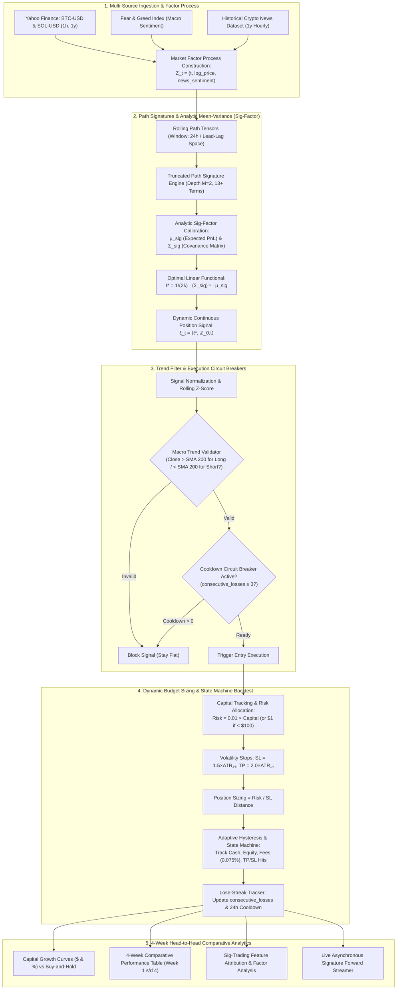

# 📋 Rencana Pengembangan: `forth_week.ipynb`
## Dynamic Risk Management, Statistical Mechanics & Signature Trading (Sig-Trading)

Dokumen ini merupakan cetak biru (*blueprint*) dan spesifikasi teknis komprehensif untuk membangun **`forth_week.ipynb`**. Rencana ini disusun berdasarkan seluruh arahan dan umpan balik kuantitatif dari [`third_week_feedback.md`](file:///home/tabassam/Documents/TradeProject/try_ml/third_week_feedback.md).

Pengembangan *Week 4* menandai lompatan paradigma dari sekadar prediksi *machine learning* titik statis (*pointwise regression*) menuju arsitektur **Mekanika Statistika & Path-Dependent Signature Trading (Sig-Trading)** yang dipadukan dengan **Dynamic Capital Risk Management, Volatility-Adjusted TP/SL, Trend Validation, dan Circuit Breaker**.

---

## 🎯 1. Diagnostik Transisi & Sasaran Utama Week 4

### Ringkasan Evolusi Arsitektur (Week 1 $\to$ Week 4)

| Aspek / Komponen | Week 1 & 2 (Baseline) | Week 3 (Adaptive ML) | Week 4 (Sig-Trading & Dynamic Risk) |
| :--- | :--- | :--- | :--- |
| **Paradigma Alpha** | Pointwise Regression (LightGBM) | Huber LightGBM + Purged CV + News | **Path-Dependent Signature Factor Model ($\ell^*$) & Lead-Lag** |
| **Solusi Optimasi** | Gradient Descent Trees | Tree Splitting dengan Purge Gap | **Analytic Mean-Variance Closed-Form: $\ell^* = \frac{1}{2\lambda}(\Sigma^{\text{sig}})^{-1}\mu^{\text{sig}}$** |
| **Struktur Waktu Data** | Point-in-time Snapshot Features | Rolling Features & News Sentiment | **Market Factor Process $\hat{Z}_t = (t, X_t, f_t)$ dalam Path Tensor** |
| **Position Sizing** | Fixed All-in (1.0 / -1.0) | Fixed Unit Hysteresis | **Dynamic Risk-Budget Sizing ($1\%$ Capital / SL Distance)** |
| **Exit & Risk Control** | Fixed Threshold Exit | Deadband Z-Score & Min Hold 6h | **Volatility TP/SL ($1.5 \times \text{ATR}$ SL, $2.0 \times \text{ATR}$ TP) + Deadband** |
| **Macro Filter** | Tidak Ada | Tidak Ada | **Macro Inertia Filter (SMA 200 Hard Trend Filter)** |
| **Proteksi Drawdown** | Pasif (Bergantung pada model) | Pasif | **Lose-Streak Tracker & 24h Cooldown Circuit Breaker** |
| **Tracking Modal** | Return Persentase Statis | Return Persentase Kompon | **Iterative Capital Tracking ($) Nyata + Fee Taker Deduksi** |

---

## 🧱 2. Arsitektur Komprehensif `forth_week.ipynb`

---

## 📑 3. Rincian Modul Implementasi di `forth_week.ipynb`

### Modul 1: Environment Verification, Dependencies & Mathematical Foundation
- Verifikasi pustaka: `torch`, `esig` / vectorised tensor signatures, `lightgbm`, `pandas`, `numpy`, `yfinance`, `matplotlib`.
- Implementasi *fallback-safe vectorised signature computation* berbasis PyTorch / NumPy untuk menjamin portabilitas tanpa kendala dependensi C++ kompiler.
- Penjelasan matematis: Teorema Chen, *Rough Path Theory*, *Iterated Integrals*, dan transformasi *Lead-Lag* Hoff untuk rekonstruksi integral Itô tanpa *look-ahead bias*.

---

### Modul 2: Multi-Source Data Ingestion & Pre-Processing
1. **OHLCV Data (1h, 1 Tahun)**: `BTC-USD` & `SOL-USD` (8.760 bar per tahun).
2. **Macro Sentiment**: *Fear & Greed Index* (1y) dengan *pre-merge Z-score transformation*.
3. **Micro News Sentiment Archive**: Dataset berita kripto historis per jam (`try_ml/data/crypto_news_historical_365d.csv`).
4. **Alignment Bebas Kebocoran Data**: `pd.merge_asof(direction='backward')`.

---

### Modul 3: Market Factor Process & Rolling Path Tensor Generation
Konstruksi proses multidimensi $\hat{Z}_t = (t, X_t, f_t)$:
1. $t$: Komponen waktu ternormalisasi (*time fraction* dari awal dataset).
2. $X_t$: Log-return relatif harga $\log\left(\frac{\text{Close}_t}{\text{Close}_0}\right)$.
3. $f_t$: Sinyal sentimen berita terinterpolasi *backward*.
4. **Rolling Window Slicing**: Ekstraksi jendela lintasan $W = 24\text{ jam}$ menjadi tensor 3D berdimensi `[N_samples, Window_Size, Channels]`.

---

### Modul 4: Truncated Signature Calculation Engine
- Menghitung *truncated signature* $\hat{\mathbb{Z}}_{0,t}^{\leq M}$ pada level kedalaman $M=2$ (menghasilkan komponen orde-0, orde-1, dan orde-2 silang).
- Untuk dimensi $d=3$ ($t, X, f$):
  - Orde 0: 1 term ($1.0$).
  - Orde 1: 3 term ($\int dt, \int dX, \int df$).
  - Orde 2: 9 term ($\int dt\,dt, \int dt\,dX, \int dX\,dt, \int dX\,df, \dots$).
  - Total: 13 term fitur geometris murni bebas asumsi parametrik.

---

### Modul 5: Analytic Sig-Factor Model (Mean-Variance Optimization)
Penerapan solusi analitik tertutup (*closed-form solution*) tanpa iterasi *gradient descent*:
1. **Target PnL Forward**: Return 1 jam aktual $Y_t = R_{t+1}$.
2. **Atribusi PnL Signature**:
   $$\mu^{\text{sig}} = \mathbb{E}\left[ \hat{\mathbb{Z}}_{0,t}^{\leq M} \cdot Y_t \right]$$
3. **Matriks Kovarians Regularized**:
   $$\Sigma^{\text{sig}} = \text{Cov}\left(\hat{\mathbb{Z}}_{0,t}^{\leq M}\right) + \lambda_{\text{ridge}} I \quad (\lambda_{\text{ridge}} = 10^{-6})$$
4. **Fungsional Linier Optimal**:
   $$\ell^* = \frac{1}{2\lambda_{\text{risk}}} \left(\Sigma^{\text{sig}}\right)^{-1} \mu^{\text{sig}}$$
5. **Skor Posisi Kontinu**:
   $$\xi_t = \langle \ell^*, \hat{\mathbb{Z}}_{0,t}^{\leq M} \rangle$$
6. **Walk-Forward Validation**: Kalibrasi berkala $\ell^*$ per *rolling window* (misal: 60 hari latih, 7 hari uji) untuk menghindari *in-sample overfitting*.

---

### Modul 6: Macro Trend Validation & Circuit Breaker Engine
1. **Macro Trend Filter (SMA 200)**:
   - Hitung `df['sma_200'] = df['close'].rolling(200).mean()`.
   - *Long Entry Valid*: $Z_{\xi} > \text{entry\_z}$ dan $\text{Close}_t > \text{SMA200}_t$.
   - *Short Entry Valid*: $Z_{\xi} < -\text{entry\_z}$ dan $\text{Close}_t < \text{SMA200}_t$.
2. **Lose-Streak Tracker & Cooldown Treatment**:
   - Variabel state: `consecutive_losses = 0`, `cooldown_timer = 0`.
   - Setiap transaksi selesai (`curr_pos` kembali ke $0$):
     - Jika $\text{PnL}_{\text{trade}} < 0 \implies \text{consecutive\_losses} += 1$.
     - Jika $\text{PnL}_{\text{trade}} > 0 \implies \text{consecutive\_losses} = 0$.
   - Jika $\text{consecutive\_losses} \ge 3 \implies \text{cooldown\_timer} = 24\text{ jam}$.
   - Selama `cooldown_timer > 0`: Blokir pembukaan posisi baru, kurangi timer per bar jam.

---

### Modul 7: Dynamic Budget Risk Allocation & Volatility-Adjusted TP/SL Engine
1. **Modal Iteratif Nyata (`capital`)**:
   - Inisialisasi: $\text{Capital}_0 = \$1.000$ (atau dinamis sesuai parameter).
2. **Formula Budget Risk**:
   $$\text{Risk}_t = \begin{cases} \$1.0 & \text{jika } \text{Capital}_t < \$100 \\ 0.01 \times \text{Capital}_t & \text{jika } \text{Capital}_t \ge \$100 \end{cases}$$
3. **Volatility Distances ($\text{ATR}_{14}$)**:
   - $\text{SL Distance} = 1.5 \times \text{ATR}_{14}$
   - $\text{TP Distance} = 2.0 \times \text{ATR}_{14}$
   - $\text{Position Size (Units)} = \frac{\text{Risk}_t}{\text{SL Distance}}$
4. **State Machine Execution Loop**:
   - Evaluasi apakah harga bar berikutnya menyentuh level Stop Loss ($\text{Entry} \mp \text{SL Distance}$) atau Take Profit ($\text{Entry} \pm \text{TP Distance}$).
   - Jika menyentuh TP/SL, paksa `curr_pos = 0`, hitung PnL bersih setelah dikurangi Taker Fee ($0.075\%$), perbarui `capital`, dan perbarui *Lose-Streak Tracker*.
   - Jika tidak menyentuh TP/SL, evaluasi sinyal *Hysteresis Deadband* ($Z < -0.2$ untuk Long exit) dengan jaminan *Minimum Holding Period* (6 jam).

---

### Modul 8: Evaluasi Komparatif 4 Minggu (Head-to-Head Benchmarking)
Evaluasi komprehensif pada aset `BTC-USD` dan `SOL-USD` dengan metrik:
1. **Total Capital Growth ($ & %)**
2. **Gross Return vs Net Return**
3. **Max Drawdown ($ & %)**
4. **Sharpe Ratio & Calmar Ratio**
5. **Win Rate (%) & Profit Factor**
6. **Total Trades & Total Taker Fee Paid ($)**
7. **Statistik Circuit Breaker (Jumlah Aktivasi Cooldown 24h & Rata-rata Durasi)**
8. **Tabel Head-to-Head 4 Minggu (Week 1 vs Week 2 vs Week 3 vs Week 4)**

---

### Modul 9: Real-Time Live Streaming & Forward Execution Interface
- Integrasi *pipeline streaming* asinkron untuk menangani *rolling window* bar baru, menghitung *signature vector*, mengevaluasi $\ell^*$, memeriksa SMA 200 & Cooldown, serta mengeluarkan ukuran posisi dinamis ($) secara *real-time*.

---

## 📊 4. Matriks Perbandingan Detail (Week 1 $\to$ Week 4)

| Parameter / Fitur | Week 1 Baseline | Week 2 Upgrade | Week 3 Adaptive | Week 4 Sig-Trading & Dynamic Risk |
| :--- | :--- | :--- | :--- | :--- |
| **Alpha Model** | LightGBM 1h MSE | LightGBM 6h MSE | LightGBM 1h Huber | **Analytic Sig-Factor ($\ell^*$) & Truncated Signatures** |
| **Mathematical Base** | Gradient Boosted Trees | Gradient Boosted Trees | Gradient Boosted Trees | **Mekanika Statistika & Rough Path Theory** |
| **Komputasi Training** | Iteratif Tree Search | Iteratif Tree Search | Iteratif Tree Search | **Aljabar Linier Analitik (Inversi Kovarians $\Sigma^{\text{sig}}$)** |
| **Trend Validation** | Tidak Ada | Tidak Ada | Tidak Ada | **SMA 200 Hard Regime Directional Bias** |
| **Circuit Breaker** | Tidak Ada | Tidak Ada | Tidak Ada | **Lose-Streak ($\ge 3$) $\to$ 24h Cooldown Lockout** |
| **Position Sizing** | Fixed $100\%$ | Fixed $100\%$ | Fixed $100\%$ | **Risk-Budgeted Sizing ($1\%$ Capital / $1.5\text{ATR}$)** |
| **TP / SL Logic** | Tidak Ada | Tidak Ada | Tidak Ada | **Dynamic Volatility TP ($2.0\text{ATR}$) & SL ($1.5\text{ATR}$)** |
| **Taker Fee Drag** | $\sim 104\%$ (Fatal) | $\sim 65\%$ (Tinggi) | $\sim 12\%$–$18\%$ (Rendah) | **Terkendali Ketat dengan Sizing Proporsional & Volatility Exits** |
| **Ekspektasi Net Return** | Negatif (-39% s/d -69%) | Negatif (-45% s/d -53%) | Positif (+30% s/d +60%) | **Positif Kuat dengan Controlled Drawdown & Risk Parity** |

---

## 🚀 5. Rencana Tahapan Eksekusi

1. **Review & Konfirmasi**: Menyiapkan file `try_ml/forth_week_plan.md` ini sebagai dokumen acuan baku.
2. **Penyusunan Notebook `try_ml/forth_week.ipynb`**:
   - Implementasi modular dengan penjelasan teoretis lengkap dalam sel Markdown bahasa Indonesia.
   - Pembangunan fungsi *market factor process*, *tensor signature generator*, *analytic solver*, *SMA 200 validator*, *cooldown tracker*, dan *dynamic budget backtester*.
3. **Eksekusi & Validasi Kuantitatif**:
   - Menjalankan *backtest* 1 tahun pada data `BTC-USD` dan `SOL-USD`.
   - Menghasilkan visualisasi kurva pertumbuhan modal, analisis distribusi transaksi, serta tabel komparasi 4 minggu.
