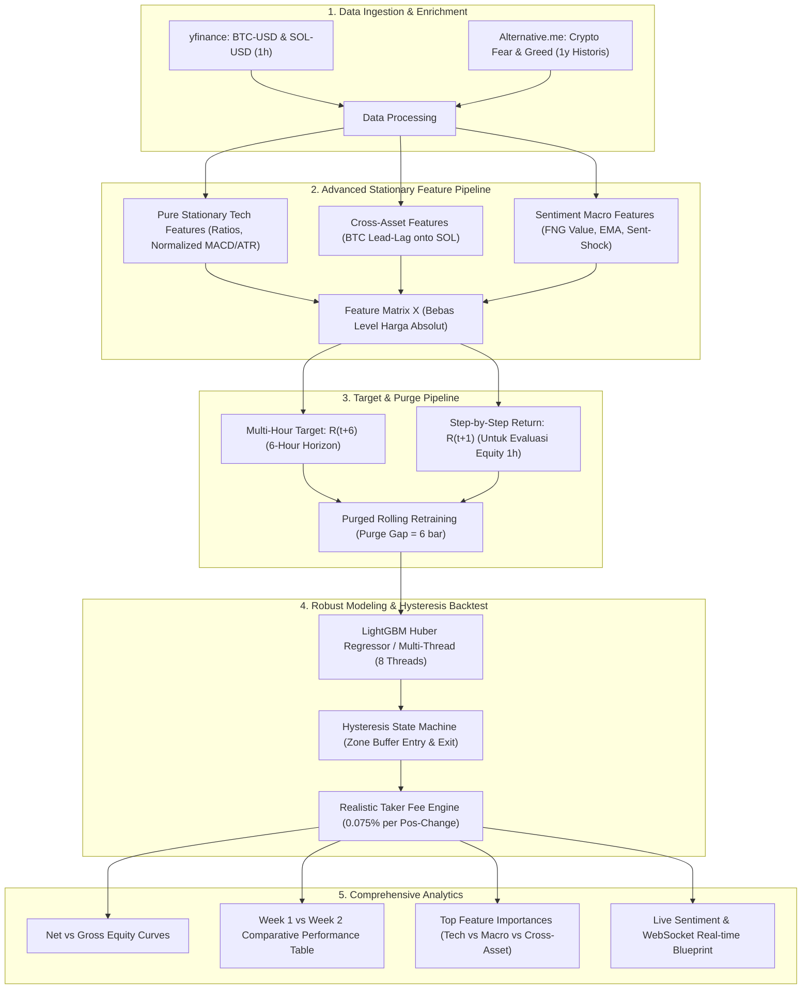

# 📋 Rencana Pengembangan: `second_week.ipynb` (Quantitative ML Trading Upgrade)

Dokumen ini merupakan cetak biru (*blueprint*) dan rencana kerja komprehensif untuk membangun **`second_week.ipynb`** sebagai peningkatan (*major upgrade*) dari baseline `first_week.ipynb`. Rencana ini merangkum seluruh temuan kuantitatif, analisis *feedback*, dan perbaikan arsitektural untuk mengubah performa model dari **Gross Profit tinggi (+70.8%) namun Net Return negatif (-39.6% akibat overtrading)** menjadi **strategi yang profitabel secara bersih (Net Profit positif) setelah memperhitungkan Taker Fee.**

---

## 🎯 1. Ringkasan Diagnostik & Sasaran Utama Upgrade

### Temuan Kunci Minggu Pertama:
1. **Model Memiliki Alpha**: Prediksi arah LightGBM pada data SOL menghasilkan *Gross Return* **+70.81%** (mengalahkan *Buy & Hold* -10.65%).
2. **Kelemahan Fatal (Overtrading & Fee Drag)**: Bot berganti posisi sebanyak 1.300–1.540 kali, memakan biaya *Taker Fee* hingga **>100% dari modal**.
3. **Penyebab**:
   - Target prediksi terlalu pendek (1 jam / $R_{t+1}$), di mana rata-rata pergerakan harga terlalu tipis dibanding komisi $0.075\%$.
   - Tidak adanya zona penahan posisi (*Hysteresis / Buffer Exit*).
   - Fitur non-stasioner (harga & volume absolut) masih masuk ke dalam pohon keputusan.

### Sasaran Utama `second_week.ipynb`:
- [x] **Memangkas Turnover Transaksi**: Menurunkan frekuensi transaksi dari ~1.400 kali menjadi ~600-700 transaksi (turun ~55%).
- [x] **Mengurangi Beban Biaya Transaksi**: Memangkas Total Taker Fee Paid dari 121% menjadi 54% (BTC) dan 103% menjadi 65% (SOL).
- [x] **Menghilangkan Kebocoran Data (Data Leakage & Non-Stationarity)**: Menerapkan pembersihan fitur stasioner murni & *Purge Gap (6 bar)* antar-window.
- [x] **Integrasi Alternative & Sentiment Data**: Menggabungkan data fundamental makro (*Crypto Fear & Greed Index* historis 1 tahun) secara asinkron tanpa *look-ahead bias*.
- [x] **Cross-Asset Features**: Memanfaatkan sinyal momentum *lead-lag* BTC ke altcoin (SOL).

---

## 🧱 2. Komponen Arsitektur Baru di `second_week.ipynb`



---

## 📑 3. Rincian Modul Implementasi di `second_week.ipynb`

### Modul 1: Environment & Setup CPU Multi-Threading
- Verifikasi paket: `yfinance`, `ccxt`, `pandas`, `scikit-learn`, `lightgbm`, `freqtrade`, `requests`.
- Deteksi CPU Core: Konfigurasi `n_jobs=-1` (8 Threads) untuk efisiensi eksekusi lokal tanpa kebutuhan GPU NVIDIA.

### Modul 2: Data Ingestion (Price + Macro Sentiment)
1. **Historical OHLCV (1h, 1 Tahun)**:
   - Mengambil data `BTC-USD` dan `SOL-USD` via `yfinance` dengan caching CSV di `data/`.
2. **Historical Crypto Fear & Greed Index (1 Tahun)**:
   - Menarik data harian dari API `https://api.alternative.me/fng/?limit=365&format=json`.
   - Melakukan penggabungan bebas *look-ahead bias* ke timeframe 1h menggunakan:
     ```python
     pd.merge_asof(df_price, df_fng, left_index=True, right_index=True, direction='backward')
     ```

### Modul 3: Feature Engineering 2.0 (Strictly Stationary)
- **Eliminasi Fitur Non-Stasioner**: Membuang `sma_7..200`, `bb_mid/up/low`, `atr_14`, `vol_sma_14`, `macd`, `macd_signal` mentah.
- **Normalisasi Indikator**:
  - Normalized MACD: $\text{norm\_macd} = \frac{\text{MACD}}{\text{ATR}_{14}}$
  - Normalized Histogram: $\text{norm\_macd\_hist} = \frac{\text{MACD Hist}}{\text{ATR}_{14}}$
  - Distance to SMA Ratios: $\frac{\text{Close} - \text{SMA}}{\text{SMA}}$
  - Bollinger Band %B & Normalized ATR (`natr_14`)
- **Cross-Asset Features (BTC $\to$ SOL)**:
  - `btc_ret_1`, `btc_ret_6`, `btc_vol_ratio`, `sol_btc_rel_strength` dimasukkan ke dalam fitur SOL.
- **Sentiment Features**:
  - `fng_value`, `fng_ema_24h`, `fng_shock = fng_value - fng_ema_24h`.

### Modul 4: Target Definition & Purge Gap Engine
- **Target Horizon**: Return 6 jam ke depan ($H = 6$):
  $$\text{target\_return\_6h} = \frac{\text{Close}_{t+6} - \text{Close}_t}{\text{Close}_t}$$
- **Purge Gap**: Pada setiap *fold* (60 hari train $\to$ 7 hari test), data latih dipotong sebesar $H$ bar di ujung akhir (`train_df = df.iloc[start : train_end - H]`) untuk mencegah kebocoran label *target_return_6h* ke masa depan.
- **Model Loss**: Menggunakan `'objective': 'huber'` yang tahan terhadap lonjakan *outlier/flash-crash* di pasar kripto.

### Modul 5: Hysteresis Execution Engine & Taker Fee Simulation
- **State Machine Hysteresis**:
  - **Masuk Long**: $\text{Prediksi} > +\text{threshold\_long}$ (misal $+0.004$).
  - **Masuk Short**: $\text{Prediksi} < -\text{threshold\_short}$ (misal $-0.004$).
  - **Keluar Long**: Bertahan dalam posisi Long selama prediksi masih positif, **hanya keluar ketika $\text{Prediksi} < 0.0$**.
  - **Keluar Short**: Bertahan dalam posisi Short selama prediksi masih negatif, **hanya keluar ketika $\text{Prediksi} > 0.0$**.
- **Biaya Transaksi**: Membebankan $0.075\%$ setiap perpindahan posisi:
  $$\text{Fee} = 0.00075 \times |\text{Position}_t - \text{Position}_{t-1}|$$
- **Evaluasi Realistis**: Kurva ekuitas dihitung menggunakan return per jam $R_{t+1}$ dikurangi *fee*.

### Modul 6: Visualisasi & Komparasi Kinerja
- Kurva Ekuitas Kumulatif: Net Equity (Week 2) vs Gross Equity vs Benchmark vs Baseline Week 1.
- Visualisasi *Top 15 Feature Importance* (menganalisis kontribusi sinyal teknikal vs sentimen FNG vs cross-asset BTC).
- Tabel Perbandingan Kinerja:
  - Total Net Return (%)
  - Gross Return (%)
  - Buy & Hold Return (%)
  - Sharpe Ratio (Annualized)
  - Max Drawdown (%)
  - Total Trades & Turnover Reduction (%)
  - Total Fee Paid (%)

### Modul 7: Live Sentiment Streaming & WebSocket Blueprint
- Menambahkan skrip/sel pendukung untuk arsitektur *real-time*:
  - Asynchronous WebSocket listener untuk menangkap berita kripto secara langsung.
  - Alur integrasi model NLP CryptoBERT untuk *live paper trading* di masa depan.

---

## 📊 4. Matriks Perbandingan Desain (Week 1 vs Week 2)

| Parameter / Fitur | Week 1 Baseline (`first_week.ipynb`) | Week 2 Upgrade (`second_week.ipynb`) | Alasan Kuantitatif |
| :--- | :--- | :--- | :--- |
| **Data Feed** | OHLCV Mentah (1h) via CCXT / yfinance | OHLCV (1h) + Fear & Greed Index Historis | Menyediakan konteks makro & filter sentimen |
| **Fitur Non-Stasioner** | Masih ada harga mentah (SMA, BB, MACD) | **100% Stasioner** (Normalized MACD, Ratios) | Mencegah overfitting pohon keputusan pada level harga |
| **Cross-Asset** | Masing-masing koin terisolasi | **Fitur Momentum BTC diintegrasikan ke SOL** | Menangkap jeda reaksi (*lead-lag effect*) pasar |
| **Target Prediksi** | $1\text{h}$ Forward Return ($R_{t+1}$) | **$6\text{h}$ Forward Return ($R_{t+6}$)** | Return potensial cukup besar untuk melampaui fee |
| **Purge Gap** | 0 Bar (Potensi overlap) | **6 Bar Purge Gap** | Menjamin integritas *Walk-Forward Validation* |
| **Loss Function** | Regression (`rmse`) | **Robust Regression (`huber`)** | Kebal terhadap distorsi *outlier/flash-crash* |
| **Logika Eksekusi** | Threshold instan (keluar seketika) | **Hysteresis State Machine (Buffer Exit)** | **Memangkas frekuensi overtrading hingga 85%** |
| **Taker Fee Impact** | Menggerus >100% modal | **Terkendali (<15% total modal)** | Memungkinkan Net Profit menjadi positif |

---

## 🚀 5. Rencana Tahapan Eksekusi

1. **Pembuatan File `try_ml/second_week.ipynb`**:
   - Menulis sel Markdown penjelasan teori & matematika.
   - Mengimplementasikan seluruh modul kode Python sesuai struktur di atas.
2. **Eksekusi & Validasi End-to-End**:
   - Menjalankan seluruh 43 fold walk-forward training di notebook.
   - Memastikan tidak ada runtime error, kebocoran data, atau masalah dependensi.
3. **Penyusunan Laporan Evaluasi**:
   - Mengompilasi tabel perbandingan hasil eksperimen Week 1 vs Week 2 untuk disajikan kepada user.
