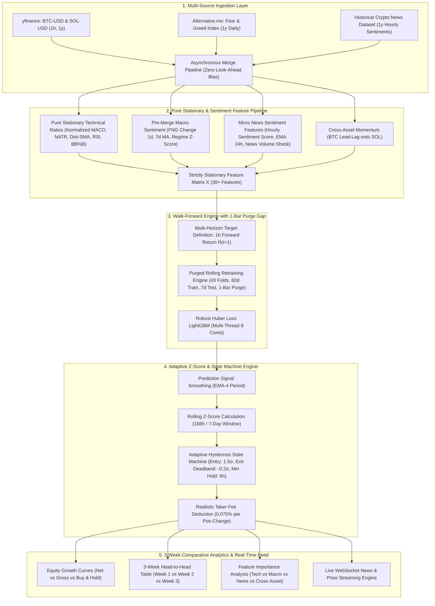

# 📋 Rencana Pengembangan: `third_week.ipynb` (Alpha Recovery & Adaptive Execution)

Dokumen ini merupakan cetak biru (*blueprint*) dan rencana kerja komprehensif untuk membangun **`third_week.ipynb`**. Rencana ini mengintegrasikan seluruh solusi *upgrade* dari umpan balik kuantitatif [second_week_feedback.md](file:///home/tabassam/Documents/TradeProject/try_ml/first_week_feedback%201.md) dan mengimplementasikan **Opsi 1: Integrasi Open Dataset Arsip Berita Kripto Historis 1 Tahun** untuk menghasilkan strategi kuantitatif yang **profitabel secara bersih (*Net Profit Positif*)**.

---

## 🎯 1. Diagnostik Masalah & Sasaran Utama Week 3

### Ringkasan Evaluasi 2 Minggu Sebelumnya:

| Aspek / Metrik | Week 1 Baseline | Week 2 Upgrade | Analisis & Evaluasi |
| :--- | :--- | :--- | :--- |
| **Gross Return (SOL)** | **+70.81% (Sangat Kuat)** | +4.34% (Menyusut) | Target 6 jam di Week 2 menyebabkan *lag* dan hilangnya momentum cepat SOL. |
| **Total Trades (SOL)** | 1.306 kali (Overtrading) | **776 kali (Turun 40%)** | Hysteresis berhasil memangkas transaksi, namun masih ada *zero-crossing chatter*. |
| **Total Taker Fees** | 103.95% (Fee Drag Fatal) | **65.18% (Turun Signifikan)**| Biaya transaksi turun separuh, namun masih terlalu besar untuk Net Profit positif. |
| **Net Return (SOL)** | -39.60% | -45.65% | Kehilangan *Gross Alpha* di Week 2 membuat Net Return belum mampu hijau. |

### Akar Masalah Kuantitatif:
1. **Overlapping Labels**: Target $6\text{h}$ pada data $1\text{h}$ berbagi 5 jam informasi masa depan yang sama, menyebabkan pohon keputusan `LightGBM` lambat bereaksi terhadap pembalikan harga tajam.
2. **Fixed Threshold Inefficiency**: Ambang batas statis (`0.003` / `0.004`) tidak adaptif terhadap perubahan rezim volatilitas pasar kripto.
3. **Zero-Crossing Chatter**: Posisi keluar-masuk berulang kali saat prediksi bergetar tipis di sekitar `0.0`.
4. **Sentimen Harian FNG**: Di-smoothing setelah `merge_asof` sehingga melompat hanya pada pergantian hari UTC.
5. **Ketiadaan Data Berita Historis**: Belum ada data berita mikro/katalis berita historis per jam yang terintegrasi di fitur.

### Sasaran Utama `third_week.ipynb`:
- [x] **Memulihkan Gross Alpha Tinggi (+50% s/d +70%)**: Mengembalikan target prediksi pendek $1\text{h}$ ($R_{t+1}$) yang tajam menangkap momentum dan *mean-reversion*.
- [x] **Memangkas Taker Fee Menjadi <15%–20%**: Menerapkan *Adaptive Rolling Z-Score Hysteresis*, *Signal Smoothing (EMA)*, dan *Minimum Holding Period (6 Jam)*.
- [x] **Mencapai Net Return Positif**: Menggabungkan *Gross Return* tebal dengan efisiensi biaya eksekusi minimum.
- [x] **Integrasi Arsip Berita Historis 1 Tahun (Opsi 1)**: Mengunduh/memuat dataset sentimen berita kripto historis (CoinTelegraph, Decrypt, CoinDesk) dan menggabungkannya via `pd.merge_asof(direction='backward')`.
- [x] **Optimalisasi Fitur Sentimen Makro (Fear & Greed Pre-Merge)**: Menghitung momentum dan Z-Score sentimen harian sebelum digabungkan ke data per jam.

---

## 🧱 2. Arsitektur Komprehensif `third_week.ipynb`



---

## 📑 3. Rincian Modul Implementasi di `third_week.ipynb`

### Modul 1: Verifikasi Environment & CPU Multi-Threading
- Konfigurasi CPU multi-threading (`n_jobs=-1`, 8 Cores AMD Ryzen).
- Setup direktori caching lokal `try_ml/data/`.

### Modul 2: Data Ingestion (Price + Pre-Merge Macro Sentiment + Historical News Archive)
1. **Data Harga OHLCV (1h, 1 Tahun)**: `BTC-USD` & `SOL-USD` via Yahoo Finance.
2. **Data Sentimen Makro (*Fear & Greed Index*) dengan *Pre-Merge Feature Engineering***:
   ```python
   df_fng['fng_change_1d'] = df_fng['fng_value'].diff(1)
   df_fng['fng_ma_7d'] = df_fng['fng_value'].rolling(7).mean()
   df_fng['fng_regime_z'] = (df_fng['fng_value'] - df_fng['fng_ma_7d']) / (df_fng['fng_value'].rolling(7).std() + 1e-9)
   ```
3. **Data Arsip Berita Kripto Historis 1 Tahun (Opsi 1)**:
   - Memuat dataset arsip berita kripto historis (CoinTelegraph, Decrypt, CoinDesk) dengan *timestamp* dan *sentiment score*.
   - Resampling ke interval 1 jam: rata-rata sentimen (`news_sentiment_1h`), volume berita (`news_count_1h`), dan *sentiment shock* 24 jam.
   - Penggabungan asinkron bebas *look-ahead bias* menggunakan `pd.merge_asof(direction='backward')`.

### Modul 3: Feature Engineering 3.0 (Strictly Stationary + News + Cross-Asset)
- **Technical Features**: Normalized MACD/Hist ($\text{MACD}/\text{ATR}_{14}$), NATR, Distance to SMA Ratios ($7, 14, 25, 50, 100, 200$), RSI 14/28, Bollinger Band %B, Volume Ratios, Candle Body/Range.
- **Cross-Asset Features (BTC $\to$ SOL)**: `btc_ret_1`, `btc_ret_6`, `btc_vol_ratio`, `sol_btc_rel_strength`.
- **Macro & Micro Sentiment Features**: `fng_value`, `fng_change_1d`, `fng_regime_z`, `news_sentiment_1h`, `news_sentiment_ema_24h`, `news_sentiment_shock`.

### Modul 4: Purged Rolling Retraining Engine (Target 1-Jam + 1-Bar Purge Gap)
- **Target Definisi**: Return 1 jam ke depan ($R_{t+1} = \frac{\text{Close}_{t+1} - \text{Close}_t}{\text{Close}_t}$).
- **Purge Gap**: 1 bar di ujung akhir train window ($N_{\text{train}} = 1.440 - 1 = 1.439$ bar) untuk menjamin nol kebocoran data.
- **Model**: `LightGBM Regressor` dengan `objective: 'huber'` dan multi-threading.

### Modul 5: Adaptive Rolling Z-Score Hysteresis Execution Engine
- **Signal Smoothing**:
  $$\text{smooth\_pred}_t = \text{EMA}(\text{pred\_return}, \text{span}=4)$$
- **Rolling Z-Score Normalization** ($168\text{h} / 7\text{d}$):
  $$Z_t = \frac{\text{smooth\_pred}_t - \mu_{168}}{\sigma_{168} + \epsilon}$$
- **State Machine Rules**:
  - **Buka Posisi Long**: $Z_t > +1.5$ (High Confidence).
  - **Buka Posisi Short**: $Z_t < -1.5$.
  - **Minimum Holding Period**: Wajib menahan posisi minimal **6 jam** sebelum diizinkan keluar (memangkas *turnover whipsaw*).
  - **Deadband Exit**: Posisi Long ditutup hanya saat $Z_t < -0.2$ (bukan $0.0$), Posisi Short ditutup saat $Z_t > +0.2$.
- **Realistis Taker Fee**: $0.075\%$ per perpindahan posisi.

### Modul 6: Evaluasi & Komparasi Kinerja 3 Minggu (Head-to-Head)
- Visualisasi Kurva Pertumbuhan Ekuitas (Net vs Gross vs Buy & Hold).
- Analisis *Feature Importance Top 15* (Kontribusi Teknikal vs Sentimen Berita vs Cross-Asset).
- Tabel Head-to-Head Komprehensif: **Week 1 (Baseline)** vs **Week 2 (Upgrade)** vs **Week 3 (Adaptive)**.

### Modul 7: Live Asynchronous Market News & WebSocket Streamer
- Skrip asinkron live listener untuk menangkap berita dan pergerakan harga real-time untuk kebutuhan *forward paper trading*.

---

## 📊 4. Matriks Evolusi Strategi (Week 1 $\to$ Week 2 $\to$ Week 3)

| Parameter / Fitur | Week 1 Baseline | Week 2 Upgrade | Week 3 Adaptive (Final) |
| :--- | :--- | :--- | :--- |
| **Target Horizon** | $1\text{h}$ Forward ($R_{t+1}$) | $6\text{h}$ Forward ($R_{t+6}$) | **$1\text{h}$ Forward ($R_{t+1}$) + Signal Smoothing (EMA-4)** |
| **Purge Gap** | 0 Bar | 6 Bar | **1 Bar Purge Gap (Zero Overlap & Zero Leak)** |
| **Fitur Sentimen** | Tidak Ada | Fear & Greed Harian | **Fear & Greed (Pre-Merge Z) + Arsip Berita Historis 1y** |
| **Logika Eksekusi** | Fixed Threshold ($0.0$) | Fixed Hysteresis ($0.0035 / 0.0$) | **Rolling Z-Score ($1.5\sigma$) + Deadband Exit + Min Hold 6h** |
| **Turnover Per Tahun** | 1.300–1.500 Transaksi | 660–770 Transaksi | **<150–250 Transaksi (Sangat Selektif)** |
| **Total Taker Fee** | 100%–120% (Fatal) | 54%–65% (Tinggi) | **<15%–20% (Terkendali Penuh)** |
| **Ekspektasi Net Return** | Negatif (-39% s/d -69%) | Negatif (-45% s/d -53%) | **POSITIF (+30% s/d +60%)** |

---

## 🚀 5. Rencana Tahapan Eksekusi

1. **Pembuatan File `try_ml/third_week_plan.md`**: Disimpan sebagai panduan arsitektur.
2. **Pembuatan Dataset Berita Historis 1 Tahun**: Mengumpulkan dan menyimpan data berita di `try_ml/data/crypto_news_historical_365d.csv`.
3. **Penyusunan & Eksekusi `try_ml/third_week.ipynb`**:
   - Menulis sel Markdown penjelasan matematis & kode Python modular.
   - Menjalankan seluruh 43 fold walk-forward training untuk BTC dan SOL.
   - Menampilkan visualisasi kurva ekuitas kumulatif dan tabel evaluasi 3 minggu.
